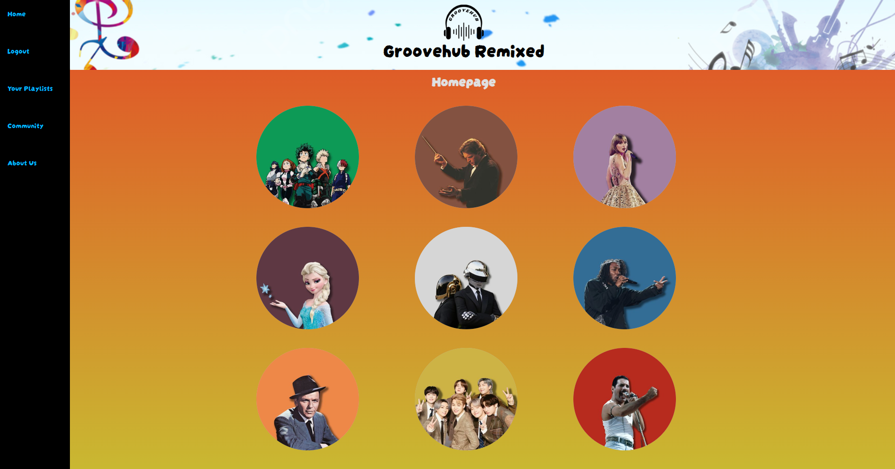
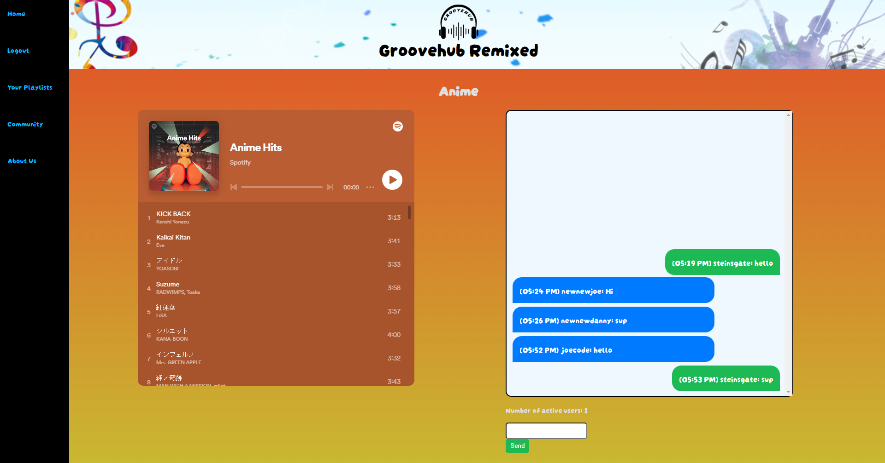
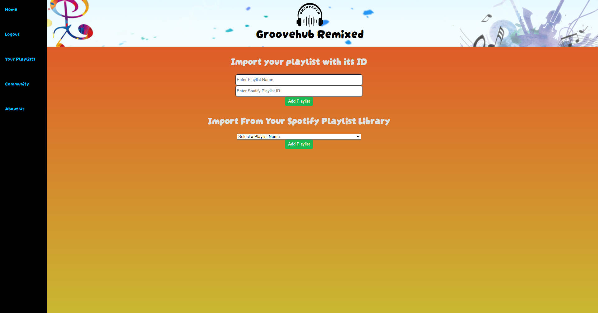
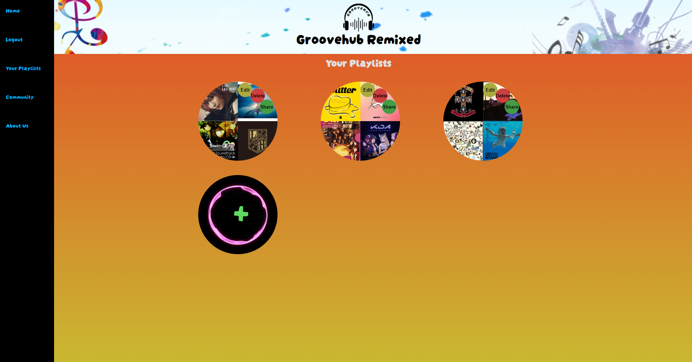

# GrooveHub-Remixed

  ##  Table of Contents 
   - [Description](#desc) 
   - [Installation](#ins)
   - [Usage](#use)
   - [Contribution Guidlines](#con) 
   - [Test Instructions](#test)
   - [Frameworks and resources](#frame)
   - [Questions/Contact](#ques)
   - [License](#license) 
  
  # Description 
  GrooveHub is a social networking site that aims to connect users with similar music tastes and help people share and discover wide varieties of music. 
  
  # Installation 
  No installation required; visit the website, create an account or sign into an existing one and login to an existing Spotify account
  
  # Usage 

  [Application Link](https://groovehub-remixed-2f12da1632a2.herokuapp.com/)

  [Sign Up/Sign In to Spotify](https://open.spotify.com/)

  Users must create an account with a valid email and sign into an exisiting Spotify account before using. From there, users can click on playlists within the community or home tabs in order to listen to the playlists from within the application and chat with active users. Users can also upload playlists from Spotify using the playlist's Spotify ID or by importing it from their Spotify playlist library.

  # Images
  Wireframe
   
  
   
  Login
   
  
   
  Homepage
   
  
   
  Chat/Playlist Page
   
  
   
    Upload Playlist
   
  
   
   User Playlists
   
  
  # Contribution Guidelines 
  None
  
  # Test Instructions 
  N/A

  # Frameworks/Resources Used 
  - ReactJS
  - MongoDB/Mongoose
  - GraphQL/Apollo
  - Google Firebase
  - Spotify Playlist API
  - Material UI
  - React Foundation

  
  # Questions/Contact 
  <a href="https://github.com/Dannymak1993">Danny Mak</a>
   
  <a href="https://github.com/Joecode22">Joe McKinney</a>
   
  <a href="https://github.com/oscarmedina234">Oscar Medina</a>
   
  <a href="https://github.com/SamH16205">Sam Halloum</a>
  

  # License
   https://opensource.org/licenses/MIT 
  
  
